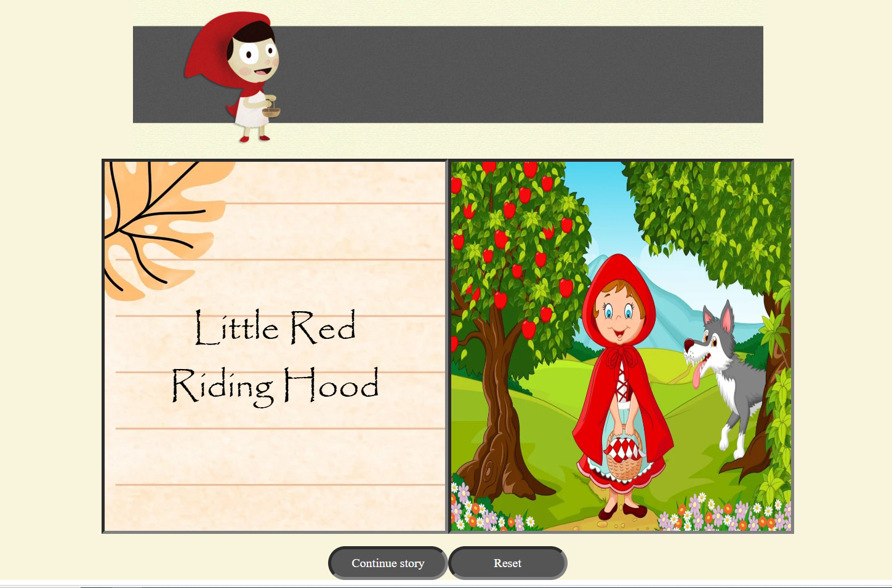
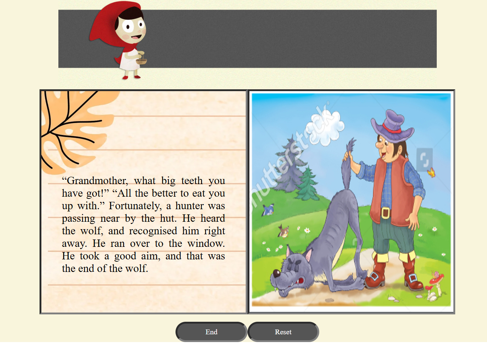

<!-- TABLE OF CONTENTS -->

  
Table of Contents

  <ol>
    <li>
      <a href="#about-the-project">About The Project</a>
      <ul>
        <li><a href="#built-with">Built With</a></li>
      </ul>
    </li>
    <li><a href="#license">License</a></li>
    <li><a href="#contact">Contact</a></li>
    
  </ol>

<!-- ABOUT THE PROJECT -->
## About The Project

Este proyecto se basa en el cuento de caperucita roja, en el cuál se puede visualizar todo el cuento a partir de capítulos, en el cuál, el contenido esta dividido en capitulos sin tener que cambiar la página principal, a su vez, hay dos botones con funcionalidad, uno para ir al capitulo siguiente y otro para reiniciar el cuento independientemente de la parte del cuento en la que te encuentres.

(<a href="#readme-top">back to top</a>)

### Built With

He creado la web a partir de html, css para el diseño y javascript para que pueda pasar un capitulo por página, y se pueda resetear para empezar el cuento en cualquier capítulo, en cada capitulo se muestra su texto correspondiente y una imagen que concuerda con lo que cuenta el capítulo.

* [![Html][Html.com]][Html-url]
* [![Css][Css.com]][Css-url]
* [![Javascript][Javascript.com]][Javascript-url]

(<a href="#readme-top">back to top</a>)

<!-- LICENSE -->
## License

None

(<a href="#readme-top">back to top</a>)

<!-- CONTACT -->
## Contact

Oscar Sordo Somohano - [Correo](oscar15-91@hotmail.com)

Project Link: [https://github.com/Oscarss15/PracticeGitLittleRedRidingHood.git](https://github.com/Oscarss15/PracticeGitLittleRedRidingHood.git)

(<a href="#readme-top">back to top</a>)

<!-- MARKDOWN LINKS & IMAGES -->
<!-- https://www.markdownguide.org/basic-syntax/#reference-style-links -->
[contributors-shield]: https://img.shields.io/github/contributors/othneildrew/Best-README-Template.svg?style=for-the-badge
[contributors-url]: https://github.com/othneildrew/Best-README-Template/graphs/contributors
[forks-shield]: https://img.shields.io/github/forks/othneildrew/Best-README-Template.svg?style=for-the-badge
[forks-url]: https://github.com/othneildrew/Best-README-Template/network/members
[stars-shield]: https://img.shields.io/github/stars/othneildrew/Best-README-Template.svg?style=for-the-badge
[stars-url]: https://github.com/othneildrew/Best-README-Template/stargazers
[issues-shield]: https://img.shields.io/github/issues/othneildrew/Best-README-Template.svg?style=for-the-badge
[issues-url]: https://github.com/othneildrew/Best-README-Template/issues
[license-shield]: https://img.shields.io/github/license/othneildrew/Best-README-Template.svg?style=for-the-badge
[license-url]: https://github.com/othneildrew/Best-README-Template/blob/master/LICENSE.txt
[linkedin-shield]: https://img.shields.io/badge/-LinkedIn-black.svg?style=for-the-badge&logo=linkedin&colorB=555
[linkedin-url]: https://linkedin.com/in/othneildrew
[product-screenshot]: images/screenshot.png
[Next.js]: https://img.shields.io/badge/next.js-000000?style=for-the-badge&logo=nextdotjs&logoColor=white
[Next-url]: https://nextjs.org/
[React.js]: https://img.shields.io/badge/React-20232A?style=for-the-badge&logo=react&logoColor=61DAFB
[React-url]: https://reactjs.org/
[Vue.js]: https://img.shields.io/badge/Vue.js-35495E?style=for-the-badge&logo=vuedotjs&logoColor=4FC08D
[Vue-url]: https://vuejs.org/
[Angular.io]: https://img.shields.io/badge/Angular-DD0031?style=for-the-badge&logo=angular&logoColor=white
[Angular-url]: https://angular.io/
[Svelte.dev]: https://img.shields.io/badge/Svelte-4A4A55?style=for-the-badge&logo=svelte&logoColor=FF3E00
[Svelte-url]: https://svelte.dev/
[Laravel.com]: https://img.shields.io/badge/Laravel-FF2D20?style=for-the-badge&logo=laravel&logoColor=white
[Laravel-url]: https://laravel.com
[Bootstrap.com]: https://img.shields.io/badge/Bootstrap-563D7C?style=for-the-badge&logo=bootstrap&logoColor=white
[Bootstrap-url]: https://getbootstrap.com
[JQuery.com]: https://img.shields.io/badge/jQuery-0769AD?style=for-the-badge&logo=jquery&logoColor=white
[JQuery-url]: https://jquery.com 
[Html.com]: https://img.shields.io/badge/Html-20232A?style=for-the-badge&logo=react&logoColor=61DAFB
[Html-url]: https://www.w3schools.com/html/default.asp
[Css.com]: https://img.shields.io/badge/Css-20232A?style=for-the-badge&logo=react&logoColor=61DAFB
[Css-url]: https://www.w3schools.com/css/default.asp
[Javascript.com]: https://img.shields.io/badge/javascript-20232A?style=for-the-badge&logo=react&logoColor=61DAFB
[Javascript-url]: https://www.w3schools.com/js/default.asp
